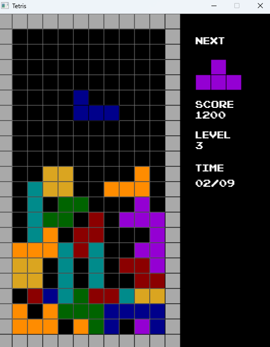
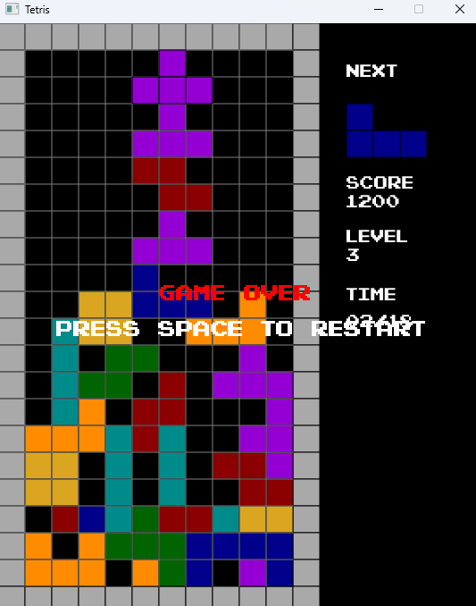

# Tetris JavaFX

## 1. Wprowadzenie
Projekt **Tetris JavaFX** to klasyczna gra w Tetris, zaimplementowana w języku Java z wykorzystaniem biblioteki JavaFX do graficznego interfejsu użytkownika. Gra oferuje pełną mechanikę Tetrisa, w tym poruszanie klockami, ich obracanie, czyszczenie pełnych linii oraz dynamiczne zwiększanie trudności wraz z postępami w grze.

---

## 2. Struktura projektu
### 2.1. Główne klasy
 - **Model:** Odpowiada za logikę gry, zarządzanie planszą, klockami, ruchami gracza oraz punktami.
 - **View:** Odpowiada za renderowanie wizualnej strony gry, w tym planszy, klocków, wyniku, poziomu oraz innych informacji.
 - **Controller:** Łączy Model i View, zarządza ruchem gracza, obsługą klawiszy oraz aktualizowaniem stanu gry.
 - **Tetris:** Klasa główna, uruchamiająca aplikację, inicjalizująca model, widok i kontroler, a także obsługująca pętlę gry.

### 2.2. Testy
Testy w projekcie zapewniają poprawność implementacji, w tym testowanie kluczowych funkcji takich jak generowanie klocków, ich ruchy, obracanie, sprawdzanie pełnych linii oraz działanie zegara gry. Testy są zaimplementowane przy użyciu JUnit.

---

## 3. Szczegóły implementacji
### 3.1. Klasa Model
Klasa **Model** zarządza całą logiką gry. Przechowuje stan gry, w tym:
- Planszę (`Color[][] board`), która przechowuje kolory komórek.
- Obecny klocek (`currentPiece`) oraz następny klocek (`nextPiece`).
- Zarządza ruchem klocków: przesuwaniem w lewo, prawo, w dół, oraz ich obracaniem.
- Odpowiada za czyszczenie pełnych linii oraz zwiększanie poziomu w zależności od zdobytych punktów.

### 3.2. Klasa View
Klasa **View** odpowiada za renderowanie gry przy użyciu JavaFX. Zawiera metody do:
- Rysowania planszy gry.
- Wyświetlania aktualnych informacji: wynik, poziom, czas.
- Renderowania klocków na planszy oraz obramowań.
- Wyświetlania komunikatów o końcu gry i możliwości restartu.

### 3.3. Klasa Controller
Klasa **Controller** zarządza interakcją użytkownika z grą. Obsługuje naciśnięcia klawiszy i przekazuje odpowiednie polecenia do modelu (ruchy klocków, obracanie). Dodatkowo kontroluje cykl gry, w tym przełączanie między stanem gry, a stanem końca gry, oraz restartowanie gry.

### 3.4. Klasa Tetris
Klasa **Tetris** jest klasą główną aplikacji. Inicjalizuje wszystkie niezbędne komponenty: model, widok, kontroler, a także uruchamia pętlę gry w metodzie `startGameLoop()`, która regularnie aktualizuje stan gry, renderuje widok i obsługuje interakcje z użytkownikiem.

---

## 4. Testy
Testy w projekcie zapewniają poprawność implementacji kluczowych funkcji:
- Klonowanie klocków (`clonePiece`).
- Sprawdzanie generowania klocków oraz ich koloru (`getNextPiece`, `getCurrentPiece`).
- Sprawdzanie możliwości ruchu i obracania klocków.
- Testowanie działania timera oraz zmian w poziomie i wyniku.
- Testowanie mechaniki gry, w tym sprawdzanie, czy gra kończy się po niemożności umieszczenia nowego klocka. 

Testy są zaimplementowane przy użyciu frameworka JUnit i obejmują zarówno testy jednostkowe, jak i testy integracyjne.

---

## 5. Zrzuty ekranu z gry



## 6. Uruchamianie gry
Aby uruchomić grę, należy mieć zainstalowaną Javę i środowisko uruchomieniowe JavaFX.
- Java 17 lub wyższa.
- JavaFX SDK (dostępne na oficjalnej stronie JavaFX).
- IDE do pracy z Javą (np. IntelliJ IDEA, Eclipse).

### 6.2. Kroki:
Sklonuj repozytorium:
    ```
    git clone https://github.com/Akineyshen/TetrisJavaFX.git
    ```